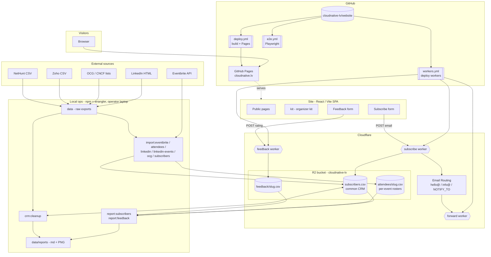

# Architecture

All of Cloud Native Latvia runs from this one repo: a static React/Vite site on GitHub
Pages, three small Cloudflare Workers writing CSVs to one R2 bucket, and a set of local
npm ops that build the community CRM and the reports. There is **no server and no
database** — R2 objects are the source of truth.

## Components

| Component | What it is | Source |
|---|---|---|
| **Site** | React 19 + Vite 7 SPA, prerendered SEO, deployed to GitHub Pages | `src/`, `scripts/prerender.mjs` |
| **Organizer kit** | Unlisted `/kit` — previews/downloads the generated promo artifacts; the **event publishing flow** lives here | `src/pages` + `src/artifacts/*` |
| **subscribe worker** | `POST {email}` → append to `subscribers.csv` (CRM) + notify via Email Routing | `workers/subscribe` |
| **feedback worker** | `POST {ratings,text}` → append to `feedback/<slug>.csv` | `workers/feedback` |
| **forward worker** | Email Worker forwarding `hello@`/`info@` to organizers | `workers/forward` |
| **R2 `cloudnative-lv`** | `subscribers.csv` (CRM), `attendees/<slug>.csv`, `feedback/<slug>.csv` | — |
| **Local ops** | npm scripts that import sources into R2, render reports, and reconcile the CRM | `scripts/*.mjs`, `scripts/lib` |
| **CI** | `deploy.yml` (site + artifacts → Pages), `workers.yml` (deploy workers), `e2e.yml` | `.github/workflows` |

## Data flows

1. **Signup / feedback** — site forms POST to the subscribe / feedback workers, which
   append rows to R2. The subscribe worker also emails organizers via Email Routing.
2. **Imports** — local ops pull from the Eventbrite API and from manual exports dropped in
   `data/` (LinkedIn, OCG/CNCF, Zoho, NetHunt), writing per-event rosters
   (`attendees/<slug>.csv`) and merging everyone into the common CRM (`subscribers.csv`).
3. **Reports** — `report:subscribers` (community & registrations) and `report:feedback`
   read R2 and render markdown + charts to `data/reports/` (both gitignored).
4. **Cleanup** — `crm:cleanup` reconciles the CRM against the NetHunt export (dedup
   discovery + email backfill).
5. **Deploy** — pushing to `main` triggers `deploy.yml` (site) and, for `workers/**`
   changes, `workers.yml`.

## R2 read caching (gotcha)

`wrangler r2 object get` serves a **cached** copy of an object after the first read and does
not invalidate it on overwrite (even `delete` + `put` within the cache window keeps serving
the old bytes). Naive read-modify-write across separate op runs can therefore read stale data
and clobber. Two mitigations in the ops:

1. Every write sets `Cache-Control: no-store` — the local ops (`scripts/lib/r2.mjs`) **and**
   the subscribe/feedback workers — so reads of those objects stay fresh going forward. (It
   can't retroactively bust an entry cached *before* the object first became no-store; that
   only clears on the cache's own TTL.)
2. `npm run rebuild` does the entire CRM + roster rebuild in a **single process** — one read
   and one write per object, reports rendered from memory — so a bulk import is always
   consistent regardless of the cache.

See **[README.md → Local operations](./README.md#local-operations)** for the op list and
**[BOOTSTRAP.md](./BOOTSTRAP.md)** for one-time Cloudflare/GitHub setup.
